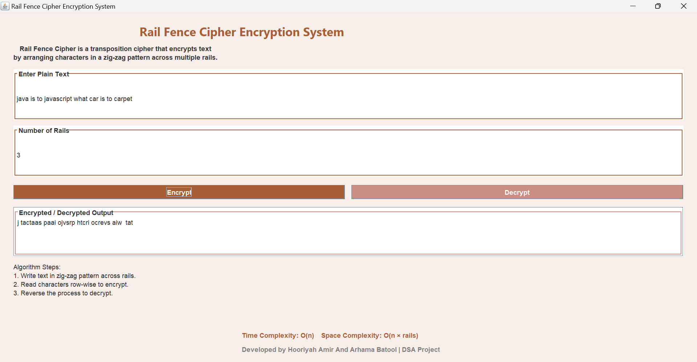

# Rail Fence Cipher Java Program

A simple Java implementation of the Rail Fence Cipher, a transposition cipher that encrypts messages by arranging the characters in a zigzag pattern across multiple rails.

## Features

- Encrypts plaintext using the Rail Fence Cipher
- Decrypts ciphertext back to plaintext
- Customizable number of rails

## How to Use

1. Clone or download this repository.
2. Compile the Java program:
```bash
javac RailFenceCipherSystem.java
```
3. Run the program:
```bash
java RailFenceCipherSystem
```

Follow the prompts to enter your message and choose the number of rails for encryption or decryption.


- **Intuitive GUI:** Easy-to-use interface for encryption and decryption
- **Customizable Rails:** Choose the number of rails for the cipher
- **Real-time Results:** Instant display of encrypted or decrypted messages
- **Input validation:** Handles edge cases and invalid inputs gracefully

## Demo Screenshot


## License

This project is licensed under the MIT License. See the LICENSE file for details.

```

